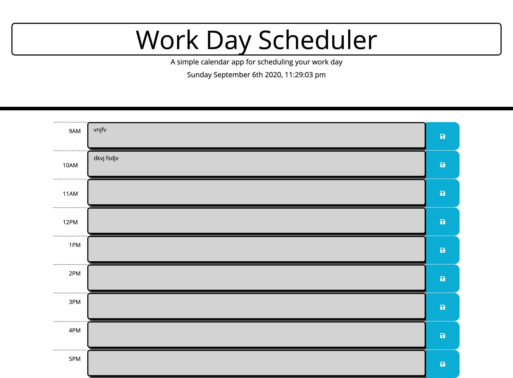

# **Work-Scheduler**
## Description
### Work Scheduler 
---
### Work Scheduler is a daily planner used the create a schedule, presenting time blocks for standard business hours, saved times, and color coated present past and future tasks.
> ## frameworks 
>* html
>* css
>* bootstrap
>* javascript
>* jQuery
>* moment.js

## Link
[work-scheduler](https://mcowley1.github.io/work-scheduler/)

